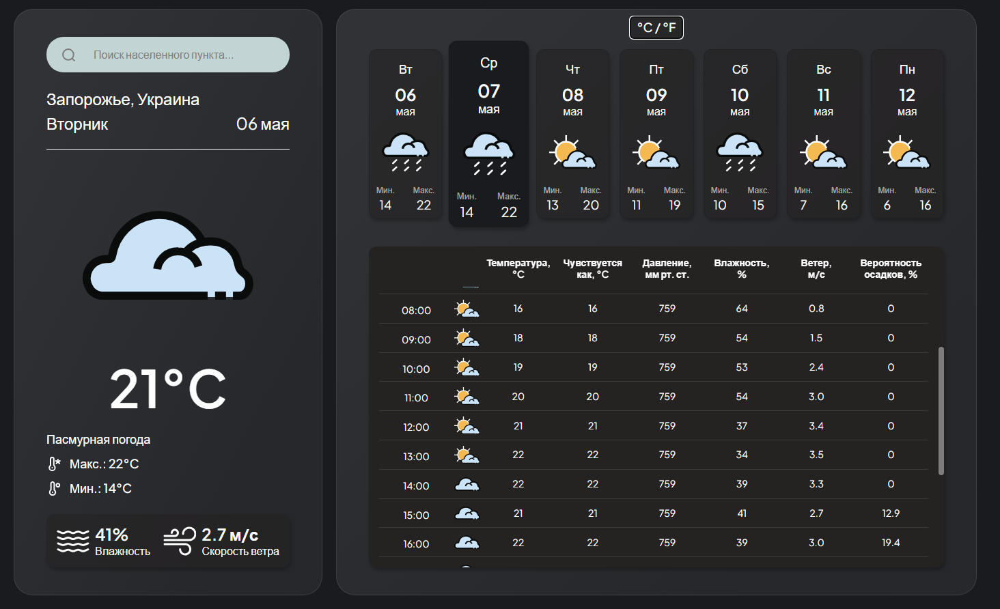

# Weather App

Учебный проект простого веб-приложения прогноза погоды, разработанный с использованием чистого HTML, CSS и JavaScript. Проект основан на минимальном шаблоне Webpack и предназначен для практики работы с API.

## 🚀 Возможности

- Получение текущей погоды и прогноза по заданному городу
- Интеграция с внешним API погоды (visualcrossing.com)
- Отображение температуры, влажности, скорости ветра и других параметров
- Сборка проекта с помощью Webpack

## 🛠️ Технологии

- HTML5, CSS3, JavaScript
- Webpack (с разделением на dev/prod конфигурации)
- ESLint и Prettier для обеспечения качества кода

## 📸 Скриншоты



## 📁 Структура проекта

```
weather-app/
├── src/
│   ├── assets/
│   │   ├── fonts/
│   │   └── img/
│   ├── js/
│   ├── styles/
│   └── index.js
│   └── template.html
│
├── dist/
├── .gitignore
├── .prettierignore
├── .prettierrc
├── eslint.config.mjs
├── package.json
├── package-lock.json
├── webpack.common.js
├── webpack.dev.js
├── webpack.prod.js
└── README.md
```

## ⚙️ Установка и запуск

1. Клонируйте репозиторий:

   ```bash
   git clone https://github.com/Roman-oryol/weather-app.git
   cd weather-app
   ```

2. Установите зависимости:

   ```bash
   npm install
   ```

3. Запустите проект в режиме разработки:

   ```bash
   npm start
   ```

4. Соберите проект для продакшена:

   ```bash
   npm run build
   ```
